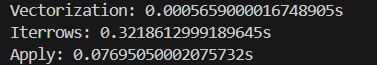
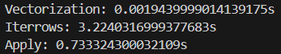
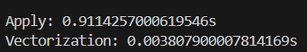

# Efficiency Comparison of Data Operations in Pandas
## Introduction
**Optimizing data operations** is crucial for efficient processing of large datasets. Three common methods in Pandas are:
  1. Vectorization: Directly operating on entire arrays for efficient processing, leveraging libraries like NumPy. Highly recommended for improved performance with large datasets.
  2. Iterating with iterrows(): Involves iterating row by row through a DataFrame using a for loop, which can be less efficient compared to vectorization due to the computational cost of accessing individual rows and columns.
  3. Using apply(): Applying a function along an axis of the DataFrame, useful for complex or custom operations. However, it may be less optimal than vectorization due to the overhead of applying a function to each row or column.

**Importance of Optimization in Data Operations**:
  1. Efficiency: Enhances performance to process data quickly and effectively.
  2. Scalability: Ensures algorithms can handle growing datasets without compromising execution time.
  3. Computational Resources: Efficient utilization of computational resources is crucial for applications requiring fast and accurate processing.
  4. Productivity: Optimization reduces task time, boosting productivity in data analysis and development.

Since efficiency on very large data is crucial, I have made a brief comparison at the code level to see how it could be more optimal. For my test, I decided to create a DataFrame of a considerable size (10000 rows), and performed a sum between the two columns (which have the same size). In this way, I will be able to check which method is the most suitable by measuring the time it takes each one to perform this operation 1 time. Let's go into the code in more detail:

## Code explanation
### Addition example
1. We will import the libraries needed for this test.
```python
import pandas as pd
import numpy as np
import timeit
```
2. We will create the example DataFrame, with the dimensions mentioned above.

```python
df = pd.DataFrame({'A': np.random.randint(1, 100, 10000),
                   'B': np.random.randint(1, 100, 10000)})
```

3. We will include the different methods to be tested, being the ones mentioned at the beginning.

   3.1. Vectorization
   ```python
   def vectorization():
     df['C'] = df['A'] + df['B']
   ```
   3.2. Iterrows
   ```python
   def iterrows():
     for index, row in df.iterrows():
       df.at[index, 'C'] = row['A'] + row['B']
   ```
   3.3. Apply
   ```python
   def apply():
     df['C'] = df.apply(lambda row: row['A'] + row['B'], axis=1)
   ```

4. Each function will be performed once, measuring the time taken to verify which was more optimal.
```python
vectorized_time = timeit.timeit(vectorization, number=1)
iterrows_time = timeit.timeit(iterrows, number=1)
apply_time = timeit.timeit(apply, number=1)

print(f"Vectorization: {vectorized_time}s")
print(f"Iterrows: {iterrows_time}s")
print(f"Apply: {apply_time}s")
```

Then, doing a test, the results were:



However, considering that the load may become heavier and would need to be performed several times, each method was tested with 10 iterations. The results were:



Imagine you have to do some operations with your dataframe that are much larger and over a long period of time, the time benefit of using vectorisation over other available options is brutal.

### Complex example
Next, a large DataFrame is created, and a complex function is applied to it using both the apply() method and vectorized operations. The goal is to compare the performance of these two approaches. By streamlining the code and enhancing its efficiency, we aim to demonstrate the benefits of vectorization over traditional iterative methods in data manipulation tasks. Let's delve into the optimized script to explore these concepts further.

1. First, the librarys.
```python
import pandas as pd
import numpy as np
import timeit
```

2. Then, the new DataFrame.
```python
np.random.seed(0)
df_large = pd.DataFrame(np.random.randint(1, 100, size=(100000, 3)),
columns=['A', 'B', 'C'])
```

3. The experiment for the apply function.
```python
def setup_large():

    # Recreate the large DataFrame
    df_large = pd.DataFrame(np.random.randint(1, 100, size=(100000, 3)),
                            columns=['A', 'B', 'C'])

    def complex_func(row):
        if row['A'] > row['B']:
            return row['A'] + row['C']
        else:
            return row['B'] - row['C']

    return df_large, complex_func

def apply_function_large():
    df_large, complex_func = setup_large()
    df_large['D_apply'] = df_large.apply(complex_func, axis=1)
```

4. The experiment for the vectorization.
```python
def vectorized_function_large():
    df_large, _ = setup_large()
    df_large['D_vect'] = np.where(df_large['A'] > df_large['B'],
                                  df_large['A'] + df_large['C'], df_large['B'] - df_large['C'])
```

5. Finally, the time taken for each function.
```python
time_apply_large = timeit.timeit(apply_function_large, number=1)
time_vect_large = timeit.timeit(vectorized_function_large, number=1)

print(f'Apply: {time_apply_large}s')
print(f'Vectorization: {time_vect_large}s')
```

For this comparison, the results in terms of time consumed were:



# Conclusion
To conclude, vectorisation is generally faster and more efficient in terms of performance, especially for simple and fast operations. However, apply() can be more flexible and useful for applying more complex functions that cannot be easily expressed as vectorised operations. In general, vectorisation is recommended whenever possible, but apply() can be a useful tool when vectorisation is not practical or sufficient.
